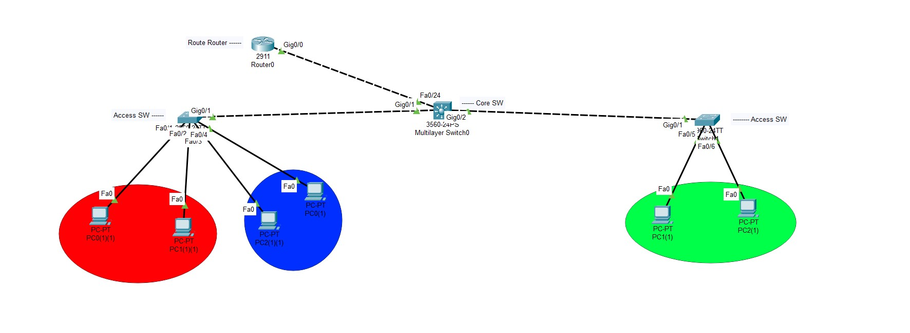

# 🔐 Advanced VLAN + DHCP + SSH Configuration Lab (Cisco Packet Tracer)

This project simulates an advanced small enterprise network setup using:
- Inter-VLAN Routing (Router-on-a-Stick)
- Dynamic IP assignment via DHCP
- Secure remote management with SSH
- Proper switch management and security best practices

---

## 🧠 Objectives

- Create and configure 3 VLANs: HR, IT, Sales
- Implement Inter-VLAN routing using subinterfaces
- Set up a DHCP server on the router to assign IPs to each VLAN
- Enable SSH access on the Core Switch
- Apply basic switch hardening (passwords, encryption, banners)
- Assign management IP addresses to switches

---

## 🖥️ Network Overview

| Device         | Function             |
|----------------|----------------------|
| Router         | Inter-VLAN Routing + DHCP Server |
| Core Switch    | Trunk to Router & Access Switches |
| Access Switch 1| VLAN 10 + VLAN 20    |
| Access Switch 2| VLAN 30              |
| PCs (6 total)  | 2 per VLAN           |

---

## 🌐 IP Address Plan

| VLAN  | Subnet           | Gateway        | DHCP Range           |
|-------|------------------|----------------|-----------------------|
| VLAN 10 | 192.168.10.0/24 | 192.168.10.1   | 192.168.10.100-150    |
| VLAN 20 | 192.168.20.0/24 | 192.168.20.1   | 192.168.20.100-150    |
| VLAN 30 | 192.168.30.0/24 | 192.168.30.1   | 192.168.30.100-150    |

---

## ⚙️ Configuration Files

Located in `/configs/`:

- `router.txt` → Subinterfaces + DHCP config  
- `core_switch.txt` → Trunk port + SSH + Management IP  
- `access_switch1.txt` → VLAN 10 & 20 ports  
- `access_switch2.txt` → VLAN 30 ports  

---

## 📂 Packet Tracer File

You can find the `.pkt` topology here:  
**`Advanced_VLAN_DHCP_SSH.pkt`**

Open it with Cisco Packet Tracer to test and verify.

---

## 💡 Learning Points

- Router-on-a-Stick setup
- DHCP pools and IP relay
- SSH configuration and testing
- Securing network devices

---

## 🔐 SSH Login Info

- **Username**: admin  
- **Password**: cisco123  
- Access via: `ssh -l admin 192.168.1.2`

---
## 🖼️ Photos 

  

---
## 🚀 Motivation

> "Push yourself, because no one else is going to do it for you."

---

## 👤 Author

Created by **HeidarAli** – Future CCNP & DevNet Pro! 🌐
